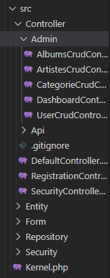
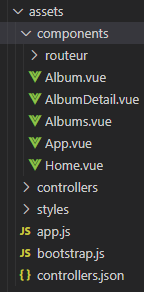
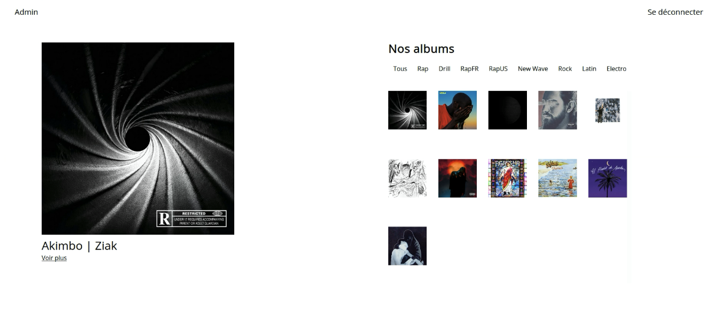
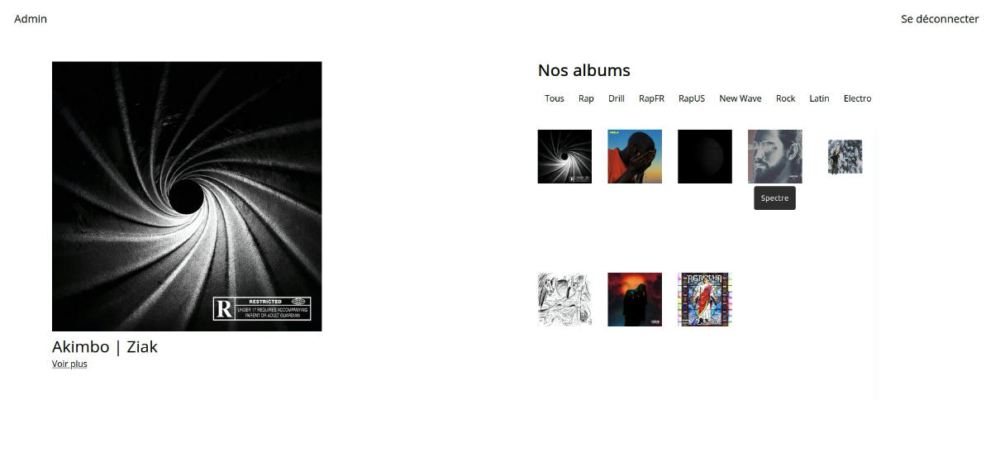
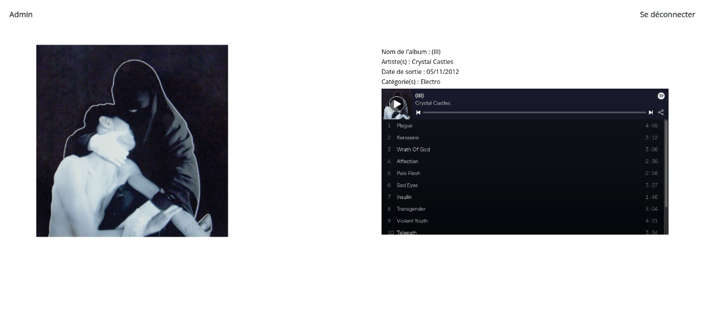
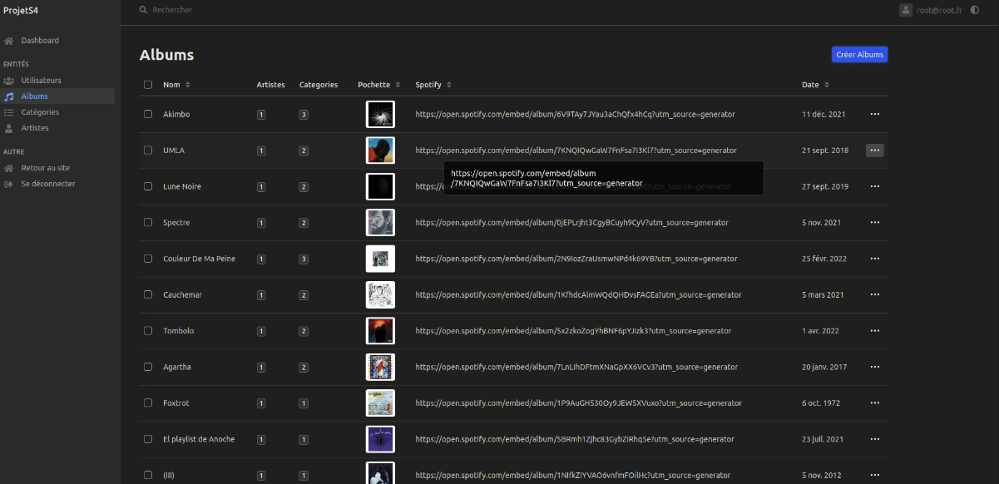

# Symphonie 

### Description

Ce site est un projet de fin d'année de l'Université de La Rochelle. Il permet de mettre en avant des albums en tout genre en suivant un design simple et épuré permettant une utilisation claire du site. Il est divisé en plusieurs parties : la page principale permettant de visualiser tout les albums de la base de données avec un système de filtre via les catégories de genres, une partie de connexion/enregistrement et un backoffice permettant l’entrée de données dans la base de données et donc dans l’API.

### Outils et méthodologie

Les deux langages utilisés sont donc Symfony pour gérer toute la partie de back office de connexion et d’enregistrement et le VueJS3 pour afficher dynamiquement les données en utilisant l’API mise en place en Symfony.

 

Nous avons donc des CrudController pour chaque entité de la base de données, un controller pour l'API et les controllers de sécurité pour la connexion et l'enregistrement.

Pour la partie VueJS nous avons donc 5 components permettant l'affichage dynamique des albums en utilisant un routeur VueJS.

Le projet est donc une seule entité et non deux séparés, avec un routeur Symfony et un
routeur VueJS. L’API est complètement gérée par Symfony et VueJS récupère les
données en JSON en suivant un lien (« /api/albums » ou « /api/categories »).

### Présentation des résultats

Ci-dessous une copie d’écran nous montre la page d’accueil lorsque qu’un admin est
connecté (s’il n’est pas admin alors il n’y aura que le bouton « Se déconnecter » dans la navbar et s’il n’est pas connecté deux boutons « Se connecter » et « S’inscrire » remplaceront le bout « Se déconnecter »). Nous avons donc une galerie d’albums à droite et en cliquant sur l’une des pochettes nous pouvons voir le nom de l’album et l’artiste ou les artistes et un lien « Voir plus » pour avoir plus d’informations sur l’album.

Ici nous pouvons voir la liste des albums en sélectionnat le genre "RapFR" où on ne voit donc plus que les albums de ce genre.

Ici nous avons les détails sur un album où nous pouvons donc voir le nom de l’album, le
groupe, la date de sortie de l’album (en français) et la catégorie ainsi que le lecteur
Spotify.

Voici le backoffice où nous pouvons ajouter et modifier des albums, des artistes, des catégories et des genres.

### Crédits

- [Arthur Gillier]("https://github.com/seg1-exe") - Réalisation du projet
- [Nicolas Trugeon]("https://lpmiaw.univ-lr.fr/") - Encadrement du projet
- [Anthony Bourmaud]('https://lpmiaw.univ-lr.fr/') - Encadrement du projet

[Université de La Rochelle]("https://www.univ-larochelle.fr/") 